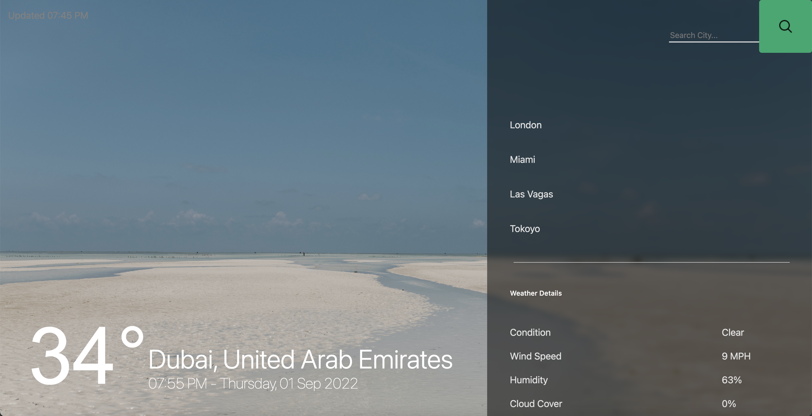

# FlaskWeatherWeb
A personal Project Showing weather data of the inputed city.

## Weather API
used https://www.weatherapi.com/ for the data in this website.

## IP Lookup API
used https://ipapi.co/ for IP address data.

## Overview
Users IP address City is pulled using the IP Lookup API which is useed as the first city shown on startup. the user can search new cities in the search box. Also the background image will change depending on the weather condition in the city chosen. 

## screenshots

